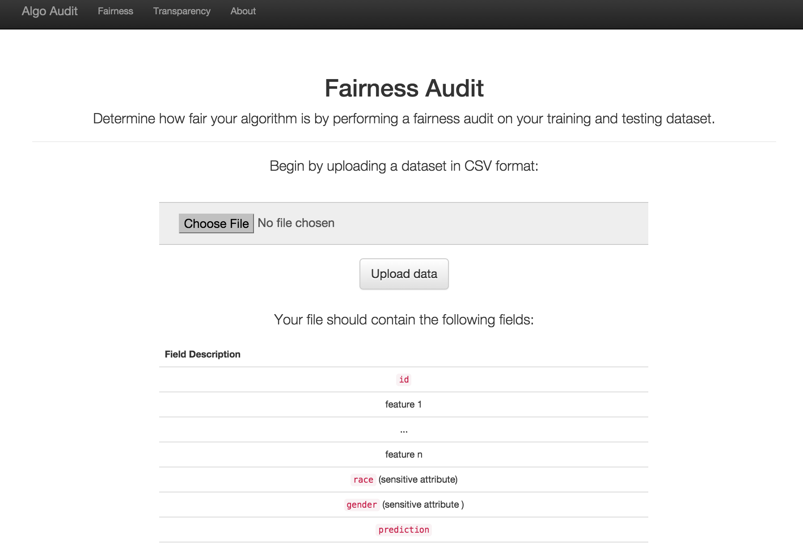
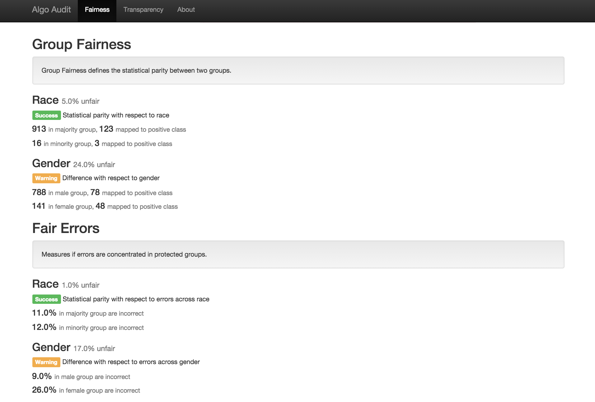

# Fairness


Algorithms are increasingly being used for decision making and risk assessment in a wide range of applications, from criminal justice to housing and employment. While algorithms are sometimes treated as impartial, it is important to evaluate how unbiased these systems really are. 

It is also important to appreciate that discrimination is not necessarily negative. In some cases discrimination is necessary or even desired. Whether each case of discrimination is problematic depends on the situation in question. These metrics also cannot determine if discrimination is intentional or unintentional. 

_WARNING:_ This is a work in progress! Stay tuned. 

## Metrics

These are a set of metrics contained in `fairness/metrics.py` that can be used to examine inputs and outputs to evaluate if there is discrimination present with respect to some protected class. 

### Disparate Impact

This metric is based on the legal term "disparate impact" and its corresponding 80 percent rule. 

### Statistical Parity / Group Fairness

Based on Zemel et al., this metrics characterizes the degree of discrimination between groups, where groups are defined with respect to some protected class. 

### Individual Fairness

Also based on Zemel et al., this metric characterizes the degree to which similar people are characterized similarly [TODO]. 

### Fairness in Errors

This metric measures if the algorithm in question has a higher error rate with respect to the protected class. Unevenly distributed errors are another way that algorithms can be unfair.

## Examples

Clone the repo and make sure the requirements (in `requirements.conda`) are satisfied. 

You can then use metrics to test how fair the algorithm's predictions are: 

```
In [2]: from fairness import metrics

In [3]: data = pd.read_csv('tests/validation.csv', index_col=0) 

In [4]: protected_status = data['gender'].values

In [5]: model_outcome = data['prediction'].values

In [6]: metrics.group_fairness(protected_status, model_outcome)
Out[6]: 0.0
```

You can infer then that this algorithm is then not-discriminatory with respect to gender.

## Auditing

This is a testing web application contained in `auditing/` enabling simple auditing of model outputs for fairness. 

First, upload your model outputs in csv format: 



Next, run the audit and examine each metric. Here is an example for an example model, demonstrating that there may be concerns with respect to the classification of women: 



## Tests

Unit tests in `tests` make use of an artificial dataset `tests/validation.csv`. The tests are run with `nosetests -v`. 

## References

Zemel, Richard S., Wu, Yu, Swersky, Kevin, Pitassi, Toniann and Dwork, Cynthia. "Learning Fair Representations.." Paper presented at the meeting of the ICML (3), 2013.

